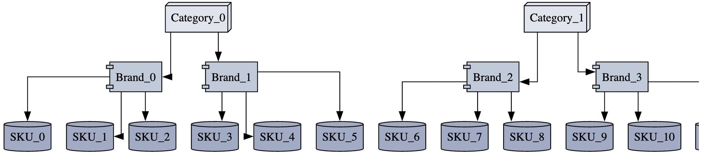

# PricePulse

PricePulse is a Python library for retail price optimization using Bayesian regression for price elasticity estimation and quadratic optimization for optimal pricing. The model incorporates hierarchical Bayesian methods, non-linear elasticity, lifecycle-aware pricing, marketing impact, and inventory constraints to maximize revenue, profit and inventory turn while maintaining stock availability

## Features

- **Hierarchical Bayesian Model:** Utilizes partial pooling across product hierarchy to share statistical strength.
- **Non-Linear Price Elasticity:** Incorporates quadratic terms in log-price to capture varying elasticity.
- **Lifecycle Stages:** Accounts for New Product Introduction (NPI), Mature, and End-of-Life (EOL) stages with distinct pricing strategies.
- **Marketing Impact:** Uses an exponential decay prior on lagged marketing spend coefficients.
- **Inventory Constraints:** Prevents stockouts by integrating inventory constraints in the optimization process.

## Self and Cross Price Elasticity Visualization

This software provides a comprehensive solution for analyzing and visualizing self-price elasticity and cross-price elasticity across a hierarchical product structure (Categories → Brands → SKUs). It is designed to help businesses understand how price changes impact demand at different levels of their product hierarchy and across various lifecycle stages.

- Visualize Product Hierarchy


- Visualize price elasticity across SKUs and product lifecycle (New Product Introduction (NPI), Mature, and End-of-Life (EOL) stages):


- Visualize price elasticity across Categories and product lifecycle (New Product Introduction (NPI), Mature, and End-of-Life (EOL) stages):


- Visualize price elasticity across Brands and product lifecycle (New Product Introduction (NPI), Mature, and End-of-Life (EOL) stages):


## Model Explainability

The library also aims to enhance the price optimizer with explainability features using feature attribution, constraint analysis, and natural language explanations. 

Sample Model Explainability Output :

```python
print(explainer.explain(optimal_price=149.99, style='detailed'))

```

```sh

Key factors in this pricing decision:
1. Price was reduced because demand is highly responsive to price changes (-1.82 elasticity)
2. Product is in mature stage where we prioritize profit maximization
3. Inventory levels healthy (current: 650, max: 1000)
4. Recent marketing spend is contributing 12.4% demand lift

Tradeoff analysis:
At $149.99: 
- Expected profit change: +18.72%
- Inventory turnover: 0.7x
- Price vs competition: -4.25% difference
```


Explanation Features:
- **Causal Factors Considered:**
  - Price elasticity magnitude and direction
  - Lifecycle stage priorities
  - Inventory position analysis
  - Marketing impact quantification
  - Tradeoff visualization between pricing and stock constraints
- **Multiple Explanation Styles:**
  - Simple bullet points for executives
  - Detailed technical breakdown for analysts
  - Visual tradeoff diagrams
- **Contextual Comparisons:**
  - Price position vs competitors
  - Inventory health status
  - Marketing contribution window


---

## ⚙️ Installation  (For Mac Users)


Step 1: Clone this repository to your local machine and navigate to the project directory

```sh
git init
git clone git@github.com:rajesh04jena/Dynamic_Price_Optimization_AutoML.git
cd Dynamic_Price_Optimization_AutoML
```

Step 2: Create a conda environment(price-pulse-test-env), install dependencies and launch IDE

Alternative 1(execute command in terminal sequentially)

```sh
conda create -n price-pulse-test-env
conda activate price-pulse-test-env
brew install graphviz
pip install -r requirements.txt
jupyter notebook
```

Alternative 2(execute command in terminal sequentially)

```sh
conda env create -f environment.yml
conda activate price-pulse-test-env
brew install graphviz
jupyter notebook
```

---

## 📌 Usage (Refer to Jupyter_Script_for_Analysts.ipynb)

Step 1: Generate Synthetic Data For Testing Purposes
- Designed to simulate real world proprietary data and retail business scenario
- Generates synthetic data to simulate product lifecycle effect on demand, simulates historical marketing efforts, competitor price,item seasonality and item trend 
```python
df = generate_dummy_data(
    n_categories=3,
    n_brands_per_category=2,
    n_skus_per_brand=3,
    start_date="2023-01-01",
    end_date="2024-12-31"
)
```

Step 2: Visualize Product Hierarchy
```python
dot = plot_hierarchical_chart(n_categories=3, n_brands_per_category=2, n_skus_per_brand=3)
dot
```


Step 3: Generate Self Price and Competitor Cross Price Elasticities

```python
results = test_elasticity_model_outputs(df)
self_elasticities = results['self_elasticities']
cross_elasticities = results['cross_elasticities']
```

Step 4: Visualize Price-Demand Relationships across a hierarchical product structure and product lifecycle ( New Product Introduction (NPI), Mature, and End-of-Life (EOL) stages )

```python
visualize_demand_projections(results['price_demand_curves'], level='brand', item_id=0)
```


Step 5: Quadratic optimization for optimal pricing

```sh
To be launched soon
```
